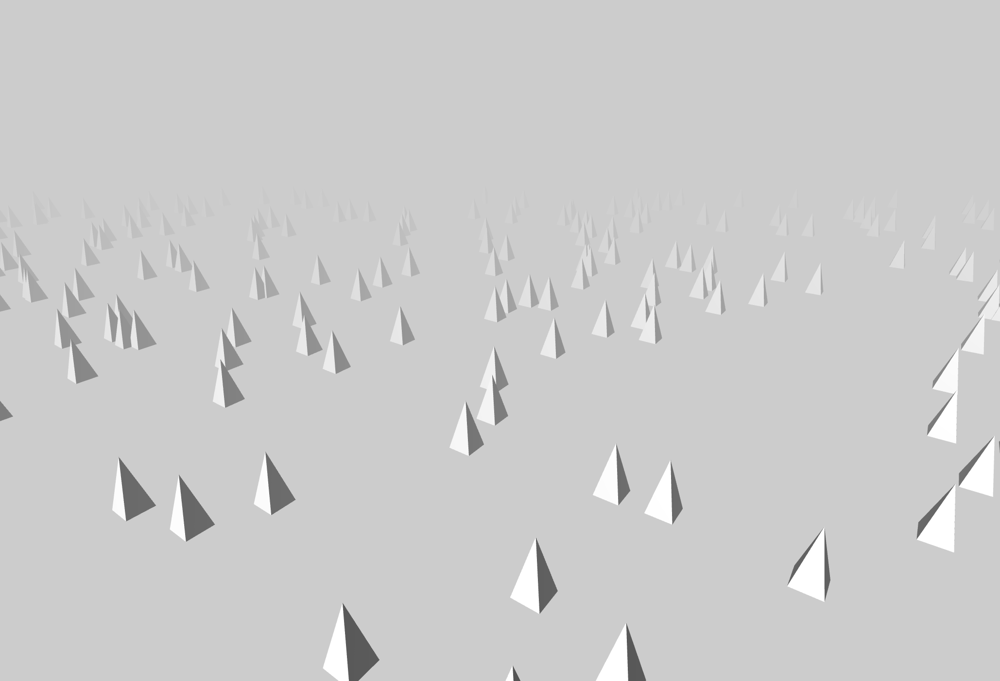

### Three.js template project for starters.

#### usage

```bash
# install dependencies
npm install
# run example
npx parcel index.html
```

#### feature

- three.js template project
  - 75 lines of code, involving common usage for:
    - scene
    - renderer
    - camera
    - fog
    - background
    - light
    - OrbitControl
    - CylinderGeometry
    - material
    - WindowResizeCallback
    - RenderLoop
  - with code structure reorganized

